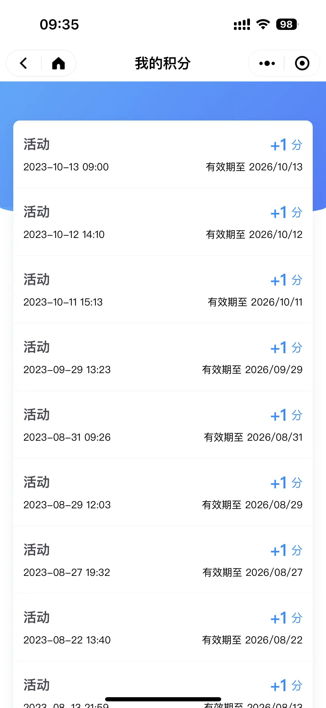
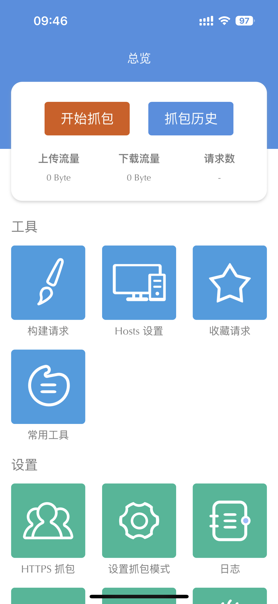
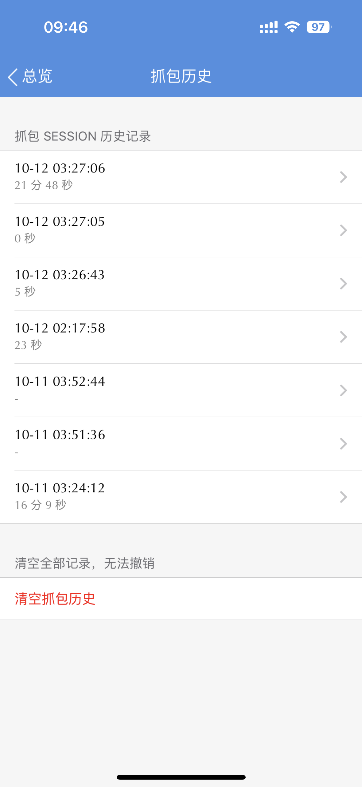
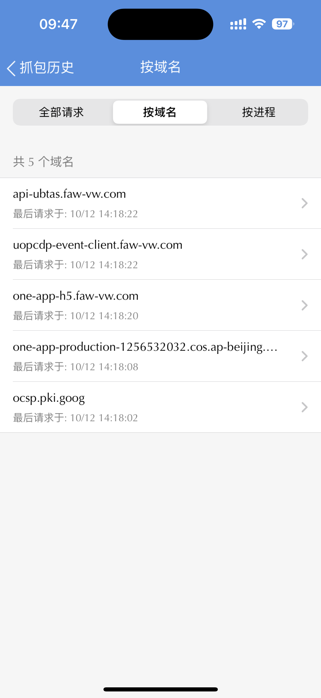
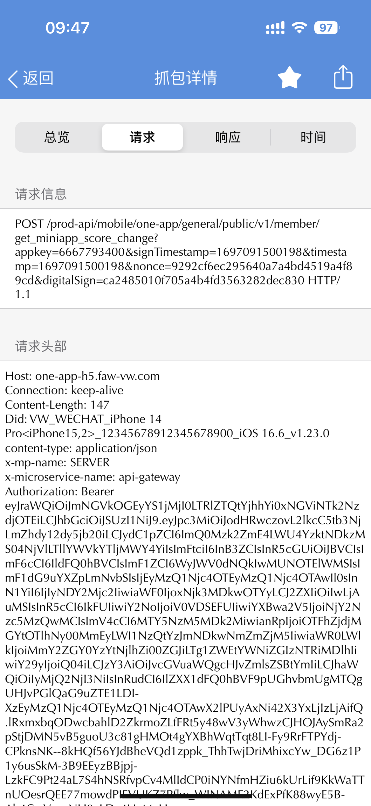
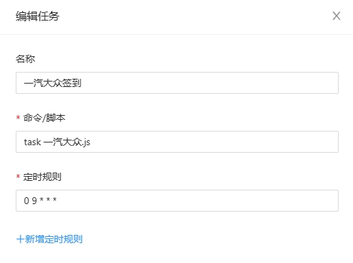

# faw-vw-auto-sign-in

#### 介绍
青龙面板，一汽大众自动签到脚本

#### 软件架构
运行环境为青龙面板，也可自行修改在node环境运行

#### 使用说明

1.  获取token
> 我这使用的是ios设备，抓取微信小程序《一汽大众》的token
> 
> App:Stream
> 
> 
> 开始抓包后去小程序随意操作一下，然后查看抓包历史》按域名排序》找到one-app-h5.faw-vw.com》找到第一个post的请求
> 
>   
> 
> 复制请求头中的token 要带Bearer

2.  打开面板，创建环境变量

> key：yqdz_data      |   value：自行抓包获取token

3.  将 一汽大众.js 放到 脚本管理的更目录中
4.  创建定时任务，可以试运行一下，能看到累计登录天数就是正确的

> 